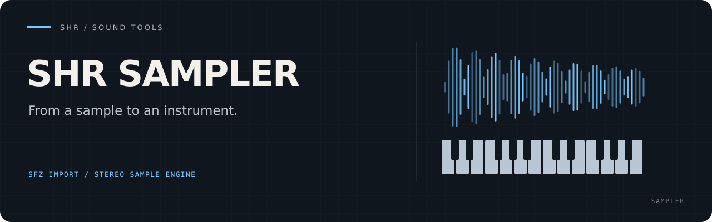

# SHR Sampler

**Turn sample packages into a playable stereo instrument.** SHR Sampler loads
`.shrinst` instruments, imports a controlled SFZ subset and runs as a headless
JACK/ALSA companion to [SHR-DAW](https://github.com/PaolaShultz/shr-daw).
It also validates packages and renders WAVs offline.

[Build and use](#build-and-use) · [Package format](docs/NATIVE_PACKAGE_FORMAT.md) · [SFZ import](docs/SFZ_IMPORT_PROFILE.md) · [Live host](docs/LIVE_PROCESS_CONTRACT.md)

- **Prepare before playback:** sample decoding happens before the render loop.
- **Keep packages portable:** strict paths, metadata and validation define each instrument.
- **Start with a cleared sound:** the repository includes the small CC0 SHR Clear Tone instrument.

## Build and use

The workspace pins Rust 1.97.1.

```sh
cargo build --locked --release -p shr-sampler
target/release/shr-sampler --version
target/release/shr-sampler validate instruments/shr-clear-tone.shrinst
mkdir -p artifacts
target/release/shr-sampler render instruments/shr-clear-tone.shrinst artifacts/clear-tone.wav

# Live use requires an existing JACK server.
target/release/shr-sampler --client-name shr-sampler \
  --instrument instruments/shr-clear-tone.shrinst
```

Import deliberately profiled SFZ produced offline by ConvertWithMoss or another
tool:

```sh
cargo run --locked -p shr-sampler -- import-sfz source.sfz piano.shrinst \
  --instrument-id piano --name "Piano" --author "Source author" \
  --source "Library and conversion provenance" --licence "Verified licence"
```

The importer refuses existing output, escaping paths, symlinks, non-WAV
samples, unsupported behavior, and any conversion it cannot represent
faithfully. ConvertWithMoss is neither invoked nor linked by SHR Sampler.

## Public factory instrument

`instruments/cleared-instruments.txt` is the installation allowlist. It names
one project-authored CC0 package, `SHR Clear Tone`, whose deterministic mono
PCM source is generated by `scripts/generate_factory_instruments.py`. The
package is intentionally small and neutral: it is a safe first-load sound, not
a claim about acoustic realism or Raspberry Pi performance.

Regenerate or verify the exact package without JACK, ALSA, or playback:

```sh
python3 scripts/generate_factory_instruments.py --write
python3 scripts/generate_factory_instruments.py --check
cargo run --locked -p shr-sampler -- validate \
  instruments/shr-clear-tone.shrinst
```

## Documentation

- [Native package format](docs/NATIVE_PACKAGE_FORMAT.md)
- [Controlled SFZ import profile](docs/SFZ_IMPORT_PROFILE.md)
- [Host architecture](docs/HOST_ARCHITECTURE.md)
- [Live process contract](docs/LIVE_PROCESS_CONTRACT.md)
- [Dependencies and licences](THIRD_PARTY.md)

Generated audition and evidence audio belongs below ignored `artifacts/` and is
disposable. Tests generate only project-authored synthetic material.

<details>
<summary>Engine and SHR-DAW integration details</summary>

The library loads and decodes every sample before constructing an engine.
`Engine::render_block` then uses fixed voice storage and performs no allocation,
locking, I/O, logging, formatting, or process work. Tests enforce exact idle
silence, finite output, deterministic event behavior, stable voice stealing,
and identical output across block sizes.

The live host attaches dynamically to an existing JACK server without starting
or changing it. It exposes `out_l`, `out_r`, and one ALSA Sequencer MIDI port
named `input`; it never auto-connects audio or opens ALSA audio. MIDI transfer,
callback work, overflow recovery, faults, and shutdown are fixed and bounded.

SHR-DAW starts this binary as one managed external instrument. SHR Sampler owns
package validation, decoded samples, synthesis voices, the ALSA input, and
stereo JACK outputs. SHR-DAW owns the exact compatibility pin, package
preflight, command and route configuration, process identity, shutdown,
replacement recovery, and Project state. `instruments/cleared-instruments.txt`
owns this repository's public package catalog; SHR-DAW's installer copies only
that cleared payload from its pinned revision.

</details>

[MIT license](LICENSE) · [Third-party notices](THIRD_PARTY.md)
